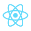
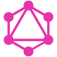
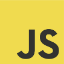
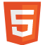

---

Welcome to the blog! For those of you who don't know me, my name is Zain Dewsi and I am a full stack developer based in Toronto. Since last year, I have been working as a digital marketer for an IT consulting company which allowed me to take on a variety of roles and gain exposure to different industries in the tech world.

As a marketer in a small/medium sized organization, we are often expected to be what is sometimes referred to as a "unicorn." This means someone that can act as a digital marketer, copywriter, graphic designer, web developer, brand manager, PR strategist, and any other area of business you can think of that is slightly related to marketing.

Now don't get me wrong, while it can definitely be challenging, this wide range of work is a great way to learn a lot of new skills and get a wholistic view of the business. In my case, it even helped me discover what I'm really pasionate about.

---

## Discovering my passion

About 6 months ago, I started learning the basics of fullstack web development so that I focus more on helping our clients create websites they could be proud of. I was mostly working with simple landing pages and small scale websites, but once I got started, I had to learn more. I started taking some online courses to do some self-study and learn about development in my spare time. After a few months of self-study, I started working on websites for some clients and even a few projects of my own. I realized that my main goal was not just to make static websites for clients, but to develop products or services that can really inspire change in the world.

---

## So what's next?

After exploring all my options, I decided that the best way to take my career to the next level was to enroll in a fully immersive full stack coding bootcamp so that I could focus all my time on learning. While it was definitely not an easy decision to forgo the stability of my full-time job, especially amidst a global pandemic, I'm really excited for this next stage of my career.

Over the next 3 months, I will be dedicating pretty much all of my time to becoming a full stack developer. The Lighthouse Labs curriculum is fully immersive and requires 60+ hours of hard work every week to really be successful so I'm looking forward to learning as much as I can.

---

## My first big project

This website is the first big project that I've worked on for myself that will be public facing, so this is where I will be showcasing some of the things I've learned so far and document my progress as I continue to learn more about development. Most portfolio websites I've seen tend to just be a place to showcase projects but I wanted to do something a bit different. I created this blog as a way to share my self-learning experience and document my bootcamp journey to hopefully help some other aspiring developers who are interested in making a career shift.

<a
    style="color:#c35fde"
    href="https://github.com/zaindewsi/personal-website"
    target="_blank"
>
    {" "}
    View the GitHub repository here{" "}
</a>

---

## Tech stack

<table>
    <tbody>
        <tr>
            <th>
                
            </th>
            <th>
                
            </th>
            <th>
                
            </th>
            <th>
                
            </th>
            <th>
                
            </th>
            <th>
                
            </th>
            <th>
                
            </th>
            <th>
                
            </th>
        </tr>
    </tbody>
</table>

This JAMstack project was built with GatsbyJS, a React-based, GraphQL powered, static site generator. Through my self-study, I was able to develop a strong understanding of HTML, CSS, and JavaScript, but I've only had minimal exposure to React. The beauty of Gatsby is that it allowed me to use the skills that I've learned to create a dynamic blog site without the use of a CMS like WordPress. The other benefit of a static site generator like Gatsby is that I was able to host the site on Netlify for free.

This project is a work in progress as I continue to learn new skills. I will be constantly improving the website with new styling, functionality, and a portfolio section to share my projects. Since the blog is going to be a big part of this site, I may add a comment section so people can sign in through their social media accounts and get some discussion going. If you have any feedback, please feel free to send me a message through the contact section or reach out on social media!
